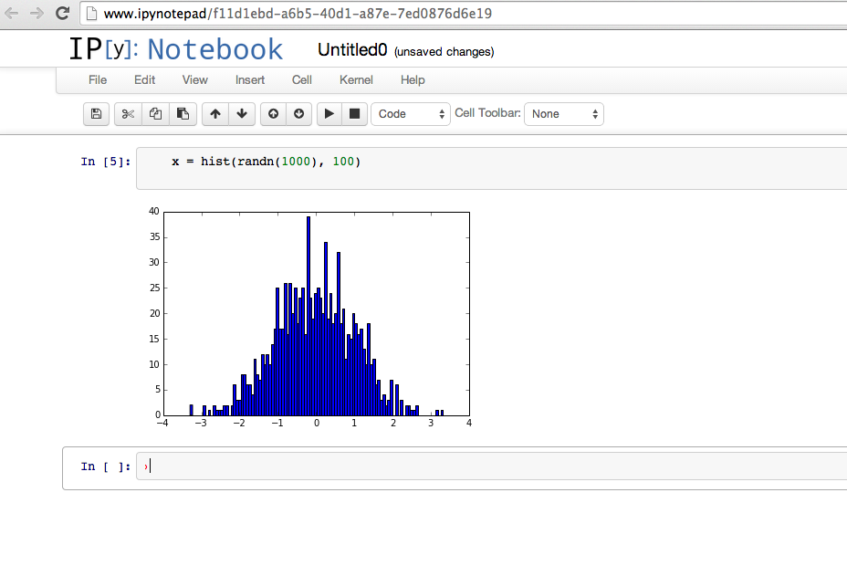

Handy Vagrant + Saltstack Development Environments
==================================================

.. contents::

Introduction
------------

In August 2012 I decided use virtual machines entirely for my development
environments. Previously I would set up a project's dependancies directly
on my Mac laptop. This could prove quite painful as most of the dependancies
compile best on Linux. This choice proved itself in other ways on changing
laptop. I was able to get back to being productive in a very short time. I've
since extended this approach to all machines I work on.

This project sets up (provisions) a blank Ubuntu machines with "technology
stacks" I'm developing with or interested in. I'm slowly going to move in set
ups I'm using which I can make public. This should help others interested in
Saltsack and Vagrant. It maybe even inspire them to improve my Saltsack knowledge.

Vagrant is great for managing virtual machine images. I use it with
Saltsack which provisions dependancies and project specifics. Saltsack states and
formulae provide the technical "how to" needed to create and re-create a
specific set up. More generally, this approach can allow a team of developers to
share a common environment. Which can save countless man hours of set up. The
automated set up allows you to concentrate on development and not the annoying
business of environment set up.

Quick Start
-----------

* Edit the $HOME/devops.ini and add the ipynotepad settings::
[ipynotepad]
address=192.168.67.39
box_url=https://cloud-images.ubuntu.com/vagrant/trusty/current/trusty-server-cloudimg-amd64-vagrant-disk1.box
box_img=trusty-server-cloudimg-amd64-vagrant-disk1.box
* Change into "ipynotepad" directory.
* Call "./box up" to start the machine.
* On your host machine open http://www.ipynotepad/ and off you go.

Prerequisits
------------

VirtualBox
~~~~~~~~~~

Download VirtualBox and Extension Pack:

 * https://www.virtualbox.org/wiki/Downloads
 * VirtualBox 4.3.10 and extensions: https://www.virtualbox.org/wiki/Downloads

Vagrant
~~~~~~~

Vagrant is used to mange virtualbox. It needs VirtualBox installed prior to
use.

 * Vagrant 1.6.0: http://www.vagrantup.com/downloads.html

The following aliases are handy to add to your .bash_profile or .bashrc::

    # vagrant aliases:
    #
    alias v="vagrant"
    alias vst="vagrant status"
    alias vup="vagrant up"
    alias vpr="vagrant provision"
    alias vhl="vagrant halt"
    alias vre="vagrant reload"
    alias vssh="vagrant ssh"

This will save lots of typing.

Common Vagrant Commands
~~~~~~~~~~~~~~~~~~~~~~~

All commands are run from the machine directory i.e. the directory containing
the Vagrantfile.

ssh into dev box::

    vagrant ssh

start a dev box::

    # Start the machine and run the provision.
    #
    # Don't try and set up two machines at the same time. Only do "vagrant up"
    # one machine at a time.
    #
    vagrant up

(re)run provision::

    # If you want to rerun the machine manifest and apply changes when the
    # machine is running:
    vagrant provision

apply changes after Vagrant file has been changed::

    # restart the machine and run provision.
    vagrant reload

stop::

    # Shutdown the machine.
    vagrant halt

ipynotepad
----------

A machine to do mathematical work on. It provides IPy Notepad running
numpy, scipy, sympy, matplotlib pandas and other tools.

Now from the ipynotepad directory start the machine::

    vagrant up

    # The machine will ask for admin access as it wants to set up
    # the 'www.ipynotepad' hostname entry in your /etc/hosts

This will take a few minutes as it download and provisions the machine. When
the command complete you can open your web browser and go to:

    http://www.ipynotepad/

Handy OSX Command line::

    open http://192.168.43.176:10080/

Now, click on the "New notebook" button. In the main right hand side type the
following into a "cell" and press shift-enter to execute::

    x = hist(randn(1000), 100)

This should produce something like:

Have a look a matplotlib gallery. You can paste any of the demo's source code
into a cell and execute it.

 * http://matplotlib.org/gallery.html

If the machine is destroyed / recreated the notebooks will still be preserved
on the host computer.

devops.ini
~~~~~~~~~~

To run the ipynotepad machine the follow devops.ini entry should be present::

    [ipynotepad]
    address=192.168.67.39
    box_url=https://cloud-images.ubuntu.com/vagrant/trusty/current/trusty-server-cloudimg-amd64-vagrant-disk1.box
    box_img=trusty-server-cloudimg-amd64-vagrant-disk1.box

